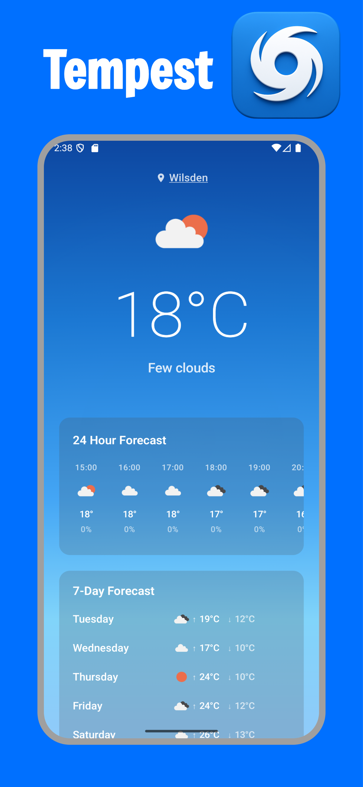

# Tempest 🌦️

A modern Android weather forecast application built with Kotlin and Jetpack Compose.

## Screenshots

<p align="center">
  
</p>

## Overview

Tempest is a weather forecast app designed to showcase clean architecture principles and modern Android development practices. The app provides current weather conditions and weekly forecasts for your current location or any selected city.

## Tech Stack

- **Language**: Kotlin
- **UI Framework**: Jetpack Compose
- **Architecture**: Clean Architecture with MVVM pattern
- **Dependency Injection**: Koin
- **Networking**: Ktor HTTP client with Kotlinx Serialization
- **Async Programming**: Kotlin Coroutines
- **Android SDK**: Target 35, Min 24
- **Build System**: Gradle with Kotlin DSL

## Getting Started

### Prerequisites

- OpenWeatherMap API key

### Setup Instructions

1. **Clone the repository**
   ```bash
   git clone git@github.com:TurnipTech/Tempest.git
   cd Tempest
   ```

2. **Configure API Key**
   - Sign up for a free API key at [OpenWeatherMap](https://openweathermap.org/api)
   - Create a `local.properties` file in the project root (if it doesn't exist)
   - Add your API key to `local.properties`:
   ```properties
   OPEN_WEATHER_API_KEY=your_api_key_here
   ```

3. **Build the project**
   ```bash
   ./gradlew build
   ```

4. **Install on device/emulator**
   ```bash
   ./gradlew installDebug
   ```

## Development

### Code Quality

The project uses **KtLint** for code formatting and style enforcement:

```bash
# Format code automatically
./gradlew ktlintFormat

# Check code style compliance
./gradlew ktlintCheck

# Run checks on all modules
./gradlew ktlintCheckAll
```

### Testing

```bash
# Run unit tests
./gradlew testDebugUnitTest

# Run all tests
./gradlew check

# Run instrumented tests (requires device/emulator)
./gradlew connectedAndroidTest
```

## Continuous Integration

GitHub Actions automatically runs on pull requests:

- **Code Style**: KtLint formatting checks
- **Unit Tests**: Automated test execution
- **Build Verification**: Ensures successful compilation

The CI pipeline runs:
1. `./gradlew ktlintCheckAll` - Code style verification
2. `./gradlew testDebugUnitTest` - Unit test execution  
3. `./gradlew assembleDebug` - Build verification

## Code Style

This project enforces consistent code style using:

- **KtLint**: Kotlin code formatting and linting
- **EditorConfig**: IDE-agnostic code style configuration
- **Compose Rules**: Additional linting rules for Jetpack Compose

Style is automatically checked in CI and should be verified before committing:

```bash
./gradlew ktlintFormat
```

## Architecture

### Module Structure
The project follows a multi-module clean architecture:

```
app/                              # Main application module with MainActivity
├── core/
│   ├── design_system/           # UI theming, colours, typography
│   ├── location/                # Location domain logic and data handling
│   ├── navigation/              # Navigation destinations interface
│   ├── network/                 # HTTP client abstraction with Ktor
│   ├── storage/                 # Data persistence abstraction with DataStore
│   └── utils/                   # Shared utility functions and resource providers
└── features/
    ├── search_location/         # Location search and selection feature
    │   ├── domain/              # Location search use cases
    │   └── ui/                  # Search screens, ViewModels, UI components
    └── weather/                 # Weather forecast feature
        ├── data/                # Repository, DTOs, mappers
        ├── domain/              # Use cases, domain models, constants
        └── ui/                  # Weather screens, ViewModels, UI components
```

### Key Patterns
- **Repository Pattern**: Clean separation between data and domain layers
- **Dependency Injection**: Koin modules for each feature
- **Navigation**: Type-safe navigation with NavigationDestination interface
- **Data Flow**: DTOs → Domain Models → UI Models with dedicated mappers
- **Use Cases**: Dedicated use case classes for business logic encapsulation, even for simple operations, to support future complexity and maintain consistent architecture patterns

## Tools Used
- **Claude Code** (Terminal application) - Code scaffolding, code review, and debugging
- **Claude** - App analysis and design decisions
- **ChatGPT** - App icon generation and design analysis

## Future Improvements
- **Snapshot Testing** - Add comprehensive snapshot tests for UI components
- **Localisation** - OpenWeatherMap offers good support for localisation (the location object in domain retains additional parameters to make this easier to implement)
- **Network Resilience** - Expand network module with caching, auto-retry, and backoff strategies
- **CI/CD Enhancement** - Add code coverage checks, automation tests, and Play Store deployment pipeline

